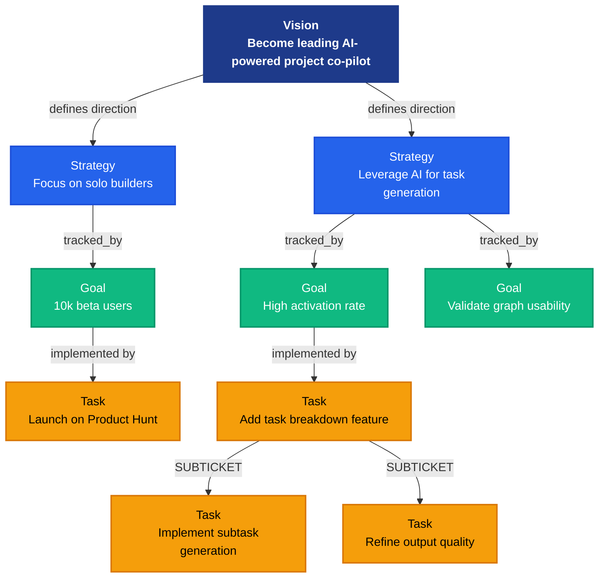

# Florque Workgraph

The Florque Workgraph is the core operational memory for Florque. It tracks the fundamental relationships between the "why" and the "what", utilizing a **Vision-Strategy-Goal-Tactics** hierarchy.

## The Vision-Strategy-Goal-Tactics Approach

Modern work often suffers from a disconnect between high-level objectives and day-to-day execution. To bridge this gap, the Workgraph is structured across four distinct conceptual layers:

1. **Vision**: The ultimate destination. It defines the aspirational end-state.
2. **Strategy**: The chosen path to achieve the vision. Strategies outline the broad approach and focus areas.
3. **Goal**: Specific, measurable milestones that indicate progress along a strategy.
4. **Tactics (Tickets/Tasks)**: The actual atomic units of work. The granular steps executed to achieve the goals.

By strictly linking tactics all the way up to a vision, every piece of work inherently carries its justification and context.

## Empowering AI Agents

The core thesis behind the Florque Workgraph is to **preserve the entire context of all tactics**. 

Standard task trackers often treat tickets as isolated units. By embedding tickets into a strongly typed graph database, we unlock powerful capabilities for AI and autonomous agents:

- **Monitoring for Purpose Drifting**: Agents can continually evaluate if the current tactics (tickets) still align with their parent Goals and Strategies. If a task drifts from its original purpose or expands out of scope, the system can flag the misalignment.
- **Bottleneck Detection**: By observing the dependency graph (what blocks what) combined with strategic goals, AI can pinpoint which specific stalled tactic is disproportionately risking a high-level outcome.
- **Context-Enriched Agentic Execution**: When an AI agent is dispatched to assist with or execute a task, it doesn't just see a narrow ticket description. It traverses the graph to understand the Goal it serves, the Strategy it belongs to, and the Vision it ultimately realizes. This deep, structured context drastically improves the quality and strategic alignment of AI-driven execution.

## Technical Implementation

- **Graph Database**: Built on top of Memgraph, queried using Cypher.
- **Domain Repositories**: Data access is encapsulated in domain-specific repositories (e.g., `TicketRepository`, `GoalRepository`, `StrategyRepository`, `VisionRepository`).
- **Tenant Isolation**: All operations are workspace-scoped by default to ensure strict multi-tenant data isolation.

## Graph topology

