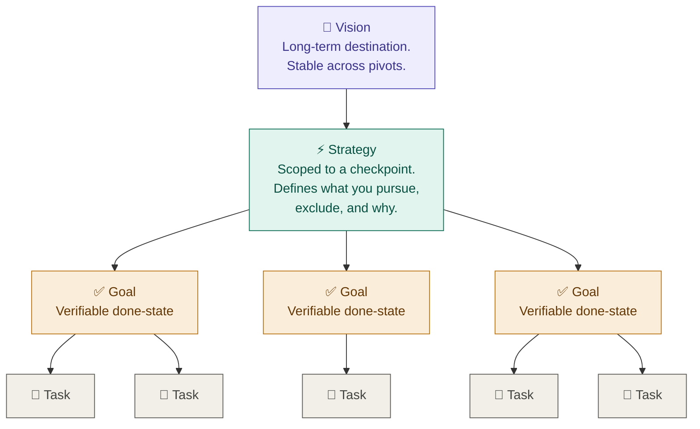
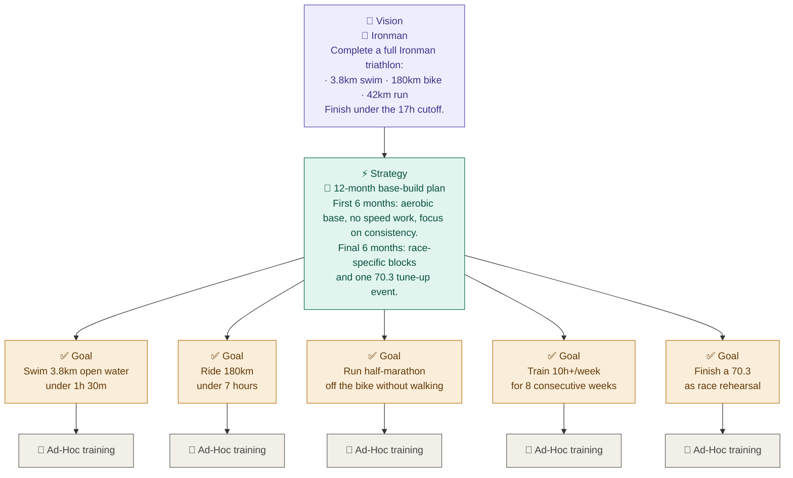

# Florque Workgraph

The Florque Workgraph is the core operational memory for Florque. It tracks the fundamental relationships between the "why" and the "what", utilizing a **Vision-Strategy-Goal-Tactics** hierarchy.

## The Vision-Strategy-Goal-Tactics Approach

Modern work often suffers from a disconnect between high-level objectives and day-to-day execution. To bridge this gap, the Workgraph is structured across four distinct conceptual layers:

1. **Vision**: The ultimate destination. It defines the aspirational end-state.
2. **Strategy**: The chosen path to achieve the vision. Strategies outline the broad approach and focus areas.
3. **Goal**: Specific, measurable milestones that indicate progress along a strategy.
4. **Tactics (Tickets/Tasks)**: The actual atomic units of work. The granular steps executed to achieve the goals.

## VSGT
# VSGT Framework

```mermaid
flowchart TD
    V["🔭 Vision\nLong-term destination.\nStable across pivots."]

    V --> S

    S["⚡ Strategy\nScoped to a checkpoint.\nDefines what you pursue,\nexclude, and why."]

    S --> G1 & G2 & G3

    G1["✅ Goal \nVerifiable done-state"]
    G2["✅ Goal \nVerifiable done-state"]
    G3["✅ Goal \nVerifiable done-state"]

    G1 --> T1 & T2
    G2 --> T3
    G3 --> T4 & T5

    T1["🔧 Task"]
    T2["🔧 Task"]
    T3["🔧 Task"]
    T4["🔧 Task"]
    T5["🔧 Task"]

    %% Styling
    classDef vision   fill:#EEEDFE,stroke:#534AB7,color:#3C3489
    classDef strategy fill:#E1F5EE,stroke:#0F6E56,color:#085041
    classDef goal     fill:#FAEEDA,stroke:#BA7517,color:#633806
    classDef task     fill:#F1EFE8,stroke:#5F5E5A,color:#444441
    classDef note     fill:#ffffff,stroke:#D3D1C7,color:#5F5E5A,font-size:12px

    class V vision
    class S strategy
    class G1,G2,G3 goal
    class T1,T2,T3,T4,T5 task
    class VNOTE,SNOTE,GNOTE,TNOTE note
```

## Personal Growth Example
Here is the personal growth vision example.

```mermaid
flowchart TD
    V["🔭 Vision\n🏅 Ironman\nComplete a full Ironman triathlon:\n· 3.8km swim · 180km bike · 42km run\nFinish under the 17h cutoff."]

    V --> S

    S["⚡ Strategy\n📅 12-month base-build plan\nFirst 6 months: aerobic base, no speed work, focus on consistency.\nFinal 6 months: race-specific blocks\nand one 70.3 tune-up event."]

    S --> G1 & G2 & G3 & G4 & G5

    G1["✅ Goal \nSwim 3.8km open water\nunder 1h 30m"]
    G2["✅ Goal \nRide 180km\nunder 7 hours"]
    G3["✅ Goal \nRun half-marathon\noff the bike without walking"]
    G4["✅ Goal \nTrain 10h+/week\nfor 8 consecutive weeks"]
    G5["✅ Goal \nFinish a 70.3\nas race rehearsal"]

    G1 --> T1
    G2 --> T2
    G3 --> T3
    G4 --> T4
    G5 --> T5

    T1["🔧 Ad-Hoc training"]
    T2["🔧 Ad-Hoc training"]
    T3["🔧 Ad-Hoc training"]
    T4["🔧 Ad-Hoc training"]
    T5["🔧 Ad-Hoc training"]

    %% Styling
    classDef vision   fill:#EEEDFE,stroke:#534AB7,color:#3C3489
    classDef strategy fill:#E1F5EE,stroke:#0F6E56,color:#085041
    classDef goal     fill:#FAEEDA,stroke:#BA7517,color:#633806
    classDef task     fill:#F1EFE8,stroke:#5F5E5A,color:#444441
    classDef note     fill:#ffffff,stroke:#D3D1C7,color:#5F5E5A,font-size:12px

    class V vision
    class S strategy
    class G1,G2,G3,G4,G5 goal
    class T1,T2,T3,T4,T5 task
    class VNOTE,SNOTE,GNOTE,TNOTE note
```
This also scales gracefully — when the project grows large goals can become new Visions as roots for new branches naturally, without needing to redesign how Goals and Tasks work.

## Key benefits for teams as well as individuals

- Clarity over busyness. Every task connects to a Goal, every Goal to a Strategy, every Strategy to a Vision. You always know why you're doing something — not just what. This eliminates the common trap of feeling productive while working on the wrong things.
- Drift protection. When a new idea, tool, or direction tempts you, VSGT gives you a natural filter: does this serve the current Strategy? If not, it's either a future Milestone conversation or a distraction. You stop chasing everything.
- Honest planning. The Strategy layer forces you to name what you're not doing. This is rare and valuable — most individuals never articulate trade-offs explicitly, which means they silently accumulate scope until nothing ships.

- Shared reasoning, not just shared tasks. Teams typically share a backlog but not the logic behind it. VSGT makes the Strategy visible to everyone — so when priorities shift, people understand why, rather than feeling managed.
- Pivot clarity. Not all changes are equal. VSGT distinguishes a Task pivot (trivial) from a Strategy pivot (medium weight) from a Vision pivot (serious decision). Teams stop having the wrong-level conversation — debating Vision when they should be adjusting a Goal, or tweaking Tasks when the Strategy is actually broken.
- Cross-domain alignment without overhead. Design, engineering, and marketing work in the same graph under a shared Strategy. Labels separate domains. No separate projects, no sync meetings just to establish what everyone is working toward — the structure carries that context.
- Orphan detection. Work that doesn't connect to a Goal becomes visible immediately. This surfaces misalignment early — before it becomes wasted sprint capacity.

## Layer reference

| Layer | Job | Changes when |
|---|---|---|
| **Vision** | Defines the destination and bounds all experiments | Fundamental market or product shift |
| **Strategy** | Reasoning + constraints for the current checkpoint | You learn something that breaks the approach |
| **Goals** | Verifiable done-states — acceptance criteria for the Strategy | Strategy changes |
| **Tasks** | The actual work, always linked to a Goal | Daily |

## Pivot classification

| Type | Weight | Trigger |
|---|---|---|
| Task pivot | Trivial | Better implementation found |
| Goal pivot | Low | Acceptance criteria were wrong |
| Strategy pivot | Medium | Core approach isn't working |
| Vision pivot | High | Fundamental rethink required |

By strictly linking tactics all the way up to a vision, every piece of work inherently carries its justification and context.

## Empowering AI Agents

The core thesis behind the Florque Workgraph is to **preserve the entire context of all tactics**. 

Standard task trackers often treat tickets as isolated units. By embedding tickets into a strongly typed graph database, we unlock powerful capabilities for AI and autonomous agents:

- **Monitoring for Purpose Drifting**: Agents can continually evaluate if the current tactics (tickets) still align with their parent Goals and Strategies. If a task drifts from its original purpose or expands out of scope, the system can flag the misalignment.
- **Bottleneck Detection**: By observing the dependency graph (what blocks what) combined with strategic goals, AI can pinpoint which specific stalled tactic is disproportionately risking a high-level outcome.
- **Context-Enriched Agentic Execution**: When an AI agent is dispatched to assist with or execute a task, it doesn't just see a narrow ticket description. It traverses the graph to understand the Goal it serves, the Strategy it belongs to, and the Vision it ultimately realizes. This deep, structured context drastically improves the quality and strategic alignment of AI-driven execution.

## Technical Implementation

- **Graph Database**: Built on top of Memgraph, queried using Cypher.
- **Domain Repositories**: Data access is encapsulated in domain-specific repositories (e.g., `TicketRepository`, `GoalRepository`, `StrategyRepository`, `VisionRepository`).
- **Tenant Isolation**: All operations are workspace-scoped by default to ensure strict multi-tenant data isolation.

## WorkGraph topology
```mermaid
graph TD

    V[Vision<br/> Become leading AI-powered project co-pilot]

    S1[Strategy<br/> Focus on solo builders]
    S2[Strategy<br/> Leverage AI for task generation]

    G1[Goal<br/> 10k beta users]
    G2[Goal<br/> High activation rate]
    G3[Goal<br/> Validate graph usability]

    T1[Task<br/> Launch on Product Hunt]
    T4[Task<br/> Add task breakdown feature]

    %% Subtickets (execution level)
    ST8[Task<br/> Implement subtask generation]
    ST9[Task<br/> Refine output quality]

    %% Vision to Strategy
    V -->|defines direction| S1
    V -->|defines direction| S2

    %% Strategy to Goals
    S1 -->|tracked_by| G1
    S2 -->|tracked_by| G2
    S2 -->|tracked_by| G3

    %% Goals to Tactics
    G1 -->|implemented by| T1
    G2 -->|implemented by| T4

    %% SUBTICKET edges (explicit)
    T4 -->|SUBTICKET| ST8
    T4 -->|SUBTICKET| ST9

    %% Styles
    classDef vision fill:#1e3a8a,color:#ffffff,stroke:#1e3a8a,stroke-width:2px,font-weight:bold;
    classDef strategy fill:#2563eb,color:#ffffff,stroke:#1d4ed8,stroke-width:2px;
    classDef goal fill:#10b981,color:#ffffff,stroke:#059669,stroke-width:2px;
    classDef tactic fill:#f59e0b,color:#000000,stroke:#d97706,stroke-width:2px;

    %% Apply styles
    class V vision;
    class S1,S2,S3 strategy;
    class G1,G2,G3, G4, G5 goal;
    class T1,T2,T3,T4,T5,ST1,ST2,ST3,ST4,ST5,ST6,ST7,ST8,ST9 tactic;
```
