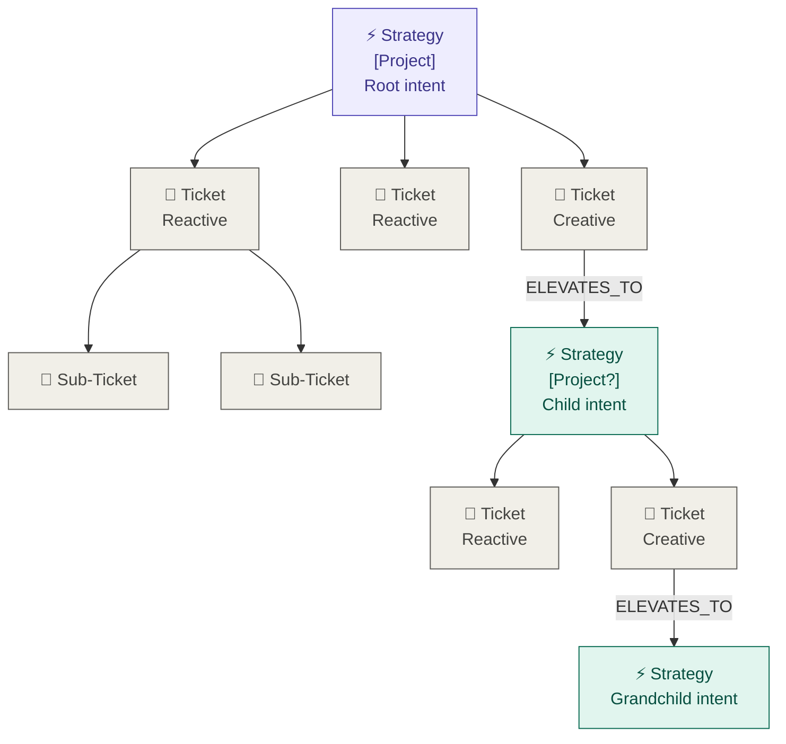
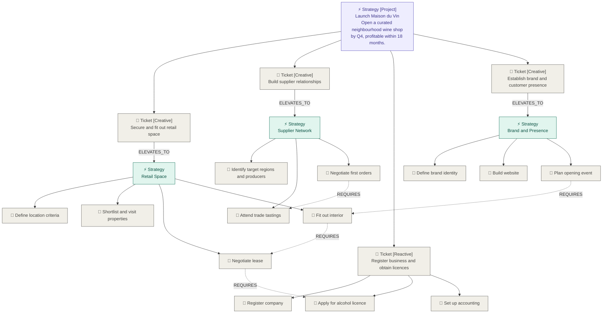

# Florque Workgraph

The Florque Workgraph is the core operational memory for Florque. It captures the complete context of any project — from intent down to execution — and makes that context available to both humans and AI agents at every level of the work.

---

## The Ontology Approach

Most project tools treat work as a flat list of tasks or a shallow hierarchy of epics and stories. Florque takes a different approach: work is modelled as a **typed graph** where every node and edge carries explicit meaning.

The graph uses only two node types — **Strategy** and **Ticket** — but allows them to compose fractally to any depth. This means the same ontology describes a birthday party, a local business launch, and a funded startup without any structural changes. What changes is depth, not kind.

---

## Core Node Types

### Strategy

A **Strategy** is an intent container. It defines a coherent slice of direction: what is being pursued, what is explicitly excluded, and why this approach was chosen. A Strategy does not describe tasks — it owns them.

A Strategy marked as **Project** represents a root or a significantly scoped sub-effort that warrants its own focus boundary. Projects are Strategies, but not all Strategies are Projects.

### Ticket

A **Ticket** is an execution unit. It always belongs to exactly one parent — either a Strategy or another Ticket. Tickets are where work actually happens.

Tickets have two subtypes, determined by their **output**, not their size or complexity:

| Subtype | Output | Spawns |
|---|---|---|
| **Reactive** | A done / not-done result | Sub-tickets (decomposition) |
| **Creative** | A scoped body of work requiring its own direction | A child Strategy |

A Reactive ticket may decompose into further sub-tickets. A Creative ticket elevates into a new Strategy, which then owns its own Tickets. This is what enables the fractal structure.

---

## Structural Edges

These edges define the shape of the graph.

| Edge | From | To | Meaning |
|---|---|---|---|
| `OWNS` | Strategy | Ticket | Strategy initializes this ticket as a first-level initiative |
| `SUBTASK` | Ticket (Reactive) | Ticket | Ticket decomposes into a sub-ticket |
| `ELEVATES_TO` | Ticket (Creative) | Strategy | Ticket spawns a child strategy |

---

## Graph Topology


```mermaid
flowchart TD
    S_ROOT["⚡ Strategy\n[Project]\nRoot intent"]

    S_ROOT --> T1["🎫 Ticket\nReactive"]
    S_ROOT --> T2["🎫 Ticket\nReactive"]
    S_ROOT --> T3["🎫 Ticket\nCreative"]

    T1 --> T1a["🎫 Sub-Ticket"]
    T1 --> T1b["🎫 Sub-Ticket"]

    T3 -->|ELEVATES_TO| S_CHILD["⚡ Strategy\n[Project?]\nChild intent"]

    S_CHILD --> T4["🎫 Ticket\nReactive"]
    S_CHILD --> T5["🎫 Ticket\nCreative"]

    T5 -->|ELEVATES_TO| S_GRANDCHILD["⚡ Strategy\nGrandchild intent"]

    classDef strategy fill:#E1F5EE,stroke:#0F6E56,color:#085041
    classDef ticket   fill:#F1EFE8,stroke:#5F5E5A,color:#444441
    classDef project  fill:#EEEDFE,stroke:#534AB7,color:#3C3489

    class S_ROOT project
    class S_CHILD,S_GRANDCHILD strategy
    class T1,T2,T3,T4,T5,T1a,T1b ticket
```

The graph grows naturally as Creative tickets surface new strategies. There is no predefined maximum depth.

---

## Relational Edges

Beyond structural edges, nodes can carry explicit relational edges that describe how work items relate to each other across the graph — including across strategy boundaries.

### `REQUIRES`

A hard dependency. Node A cannot start or be considered complete until node B is resolved.

- Always declared at the **ticket level**, even when the two tickets belong to different strategies.
- Strategies do not require each other. If coordination between strategies is needed, it surfaces through their tickets.
- Direction: `A REQUIRES B` — B must be resolved first.

### `RELATED`

A soft context link. Two nodes share context that is useful to whoever works on either, but neither blocks the other.

- Undirected — no execution constraint is implied.
- Use when: a ticket was split from another, two workstreams overlap in domain, or a decision in one place should inform a decision elsewhere.
- `RELATED` is not a weak `REQUIRES`. Do not use it as a proxy for a dependency you are unwilling to make explicit.

---

## Work Layers

The graph nodes and edges above form the **Execution layer** — the spine of the workgraph. Three additional layers live alongside it, each adding a distinct dimension of information without changing the graph structure itself.

### Execution Layer
The graph as described: Strategies, Tickets, structural edges, and relational edges. This layer answers *what* is being done and *why*.

### Resources Layer _(planned)_
Captures who or what is assigned to each node — people, teams, tools, budgets. Resources are attached to nodes; they do not change the graph shape. This layer answers *who* is doing this and *with what*.

### Timeline Layer _(planned)_
Captures scheduling information — start dates, deadlines, cadences, timeboxes, and delivery containers. Time constraints are overlaid on existing nodes without altering their relationships. This layer answers *when*.

### Collaboration Layer _(planned)_
Captures communication and coordination signals — comments, decisions, status updates, reviews, and approvals. These live on nodes and edges without polluting the execution structure. This layer answers *how work is coordinated*.

All four layers share the same graph. Querying any node returns a view that combines execution context, resource assignment, timing, and collaboration state — without needing to navigate separate systems.

---

## Example: Local Wine Store Launch


```mermaid
flowchart TD
    ROOT["⚡ Strategy [Project]\nLaunch Maison du Vin\nOpen a curated neighbourhood wine shop\nby Q4, profitable within 18 months."]

    ROOT --> T_SPACE["🎫 Ticket [Creative]\nSecure and fit out retail space"]
    ROOT --> T_SUPPLY["🎫 Ticket [Creative]\nBuild supplier relationships"]
    ROOT --> T_OPS["🎫 Ticket [Reactive]\nRegister business and obtain licences"]
    ROOT --> T_BRAND["🎫 Ticket [Creative]\nEstablish brand and customer presence"]

    T_SPACE -->|ELEVATES_TO| S_SPACE["⚡ Strategy\nRetail Space"]
    S_SPACE --> TS1["🎫 Define location criteria"]
    S_SPACE --> TS2["🎫 Shortlist and visit properties"]
    S_SPACE --> TS3["🎫 Negotiate lease"]
    S_SPACE --> TS4["🎫 Fit out interior"]

    T_SUPPLY -->|ELEVATES_TO| S_SUPPLY["⚡ Strategy\nSupplier Network"]
    S_SUPPLY --> TV1["🎫 Identify target regions and producers"]
    S_SUPPLY --> TV2["🎫 Attend trade tastings"]
    S_SUPPLY --> TV3["🎫 Negotiate first orders"]

    T_OPS --> TOP1["🎫 Register company"]
    T_OPS --> TOP2["🎫 Apply for alcohol licence"]
    T_OPS --> TOP3["🎫 Set up accounting"]

    T_BRAND -->|ELEVATES_TO| S_BRAND["⚡ Strategy\nBrand and Presence"]
    S_BRAND --> TB1["🎫 Define brand identity"]
    S_BRAND --> TB2["🎫 Build website"]
    S_BRAND --> TB3["🎫 Plan opening event"]

    TS3 -.->|REQUIRES| TOP2
    TS4 -.->|REQUIRES| TS3
    TV3 -.->|REQUIRES| TV2
    TB3 -.->|REQUIRES| TS4

    classDef project  fill:#EEEDFE,stroke:#534AB7,color:#3C3489
    classDef strategy fill:#E1F5EE,stroke:#0F6E56,color:#085041
    classDef ticket   fill:#F1EFE8,stroke:#5F5E5A,color:#444441

    class ROOT project
    class S_SPACE,S_SUPPLY,S_BRAND strategy
    class T_SPACE,T_SUPPLY,T_OPS,T_BRAND,TS1,TS2,TS3,TS4,TV1,TV2,TV3,TOP1,TOP2,TOP3,TB1,TB2,TB3 ticket
```

---

## How to Build a Work Graph

When planning any project, the graph is built layer by layer:

**1. Define the root Strategy**
One clear statement: what does done look like for this project? Mark it as `Project`.

**2. First execution layer**
List tickets directly under the root strategy. These are first-class initiatives — broad enough to group work, specific enough to own a clear outcome. Do not over-decompose here.

**3. Classify each ticket**
For each ticket: does resolving it produce a standalone body of work that needs its own direction and focus? If yes → `Creative`, elevate to a child Strategy. If no → `Reactive`, decompose into sub-tickets as needed.

**4. Recurse**
Repeat steps 2–3 for each child Strategy. Stop decomposing when a ticket is atomic — a single person can execute it without further clarification.

**5. Declare relational edges**
Scan for hard dependencies and add `REQUIRES` edges. Add `RELATED` edges where shared context genuinely matters to an executor.

---

## Rules

- Every ticket has exactly one parent. No orphans.
- Ticket type is determined by its **output**, not its size or complexity.
- `REQUIRES` is always declared at the ticket level. Strategies do not require each other.
- `RELATED` is not a weak `REQUIRES`. Use it only when context genuinely overlaps.
- Do not create a child Strategy unless the Creative ticket's output truly needs its own intent to execute.
- A Strategy marked `Project` signals a focus boundary — use it deliberately, not for every child strategy.

---

## Empowering AI Agents

The core thesis behind the Florque Workgraph is to **preserve the full context of all tactics**.

Standard task trackers treat tickets as isolated units. By embedding work into a strongly typed graph, Florque unlocks capabilities that flat tools cannot provide:

- **Context-enriched execution.** When an agent is dispatched to assist with a ticket, it does not see a narrow description. It traverses the graph upward to understand the Strategy it serves, the intent it ultimately realizes, and the constraints declared by sibling tickets. This depth of context directly improves the quality of AI-driven execution.
- **Purpose drift detection.** Agents can evaluate whether a ticket's current scope still aligns with the Strategy that owns it. When a task expands beyond its original intent, the system surfaces the misalignment before it becomes wasted work.
- **Bottleneck detection.** By observing the `REQUIRES` dependency graph alongside strategic priorities, agents can identify which stalled ticket is disproportionately risking a high-level outcome.
- **Graph-aware planning.** When asked to plan a new project, agents build a graph — not a list — because the ontology gives them a structure to reason about intent, decomposition, and dependency simultaneously.

---

## Technical Implementation

- **Graph Database:** Memgraph, queried using Cypher.
- **Domain Repositories:** Data access encapsulated in domain-specific repositories (`TicketRepository`, `StrategyRepository`).
- **Tenant Isolation:** All operations are workspace-scoped by default for strict multi-tenant data isolation.

### Development Setup

From the root directory of the backend project (`florque-backend/florque`), run:

```bash
pip install -e florque_workgraph
```

This installs the package in editable mode. Only needs to be run once, or when dependencies in `pyproject.toml` change.